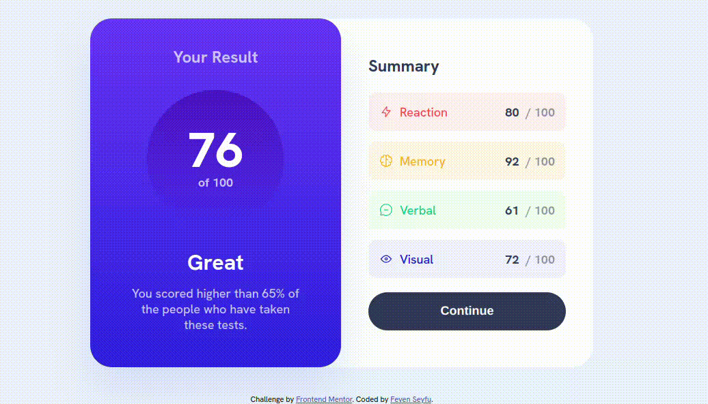

# Frontend Mentor - Results summary component solution

This is a solution to the [Results summary component challenge on Frontend Mentor](https://www.frontendmentor.io/challenges/results-summary-component-CE_K6s0maV). which is A single page Result summary displaying UI with responsive layout.



## Table of contents

- [Overview](#overview)
  - [The challenge](#the-challenge)
  - [Links](#links)
- [My process](#my-process)
  - [Built with](#built-with)
  - [What I learned](#what-i-learned)
- [Author](#author)
- [Acknowledgments](#acknowledgments)

## Overview

### The challenge

Users should be able to:

- View the optimal layout for the interface depending on their device's screen size
- See hover and focus states for all interactive elements on the page
- **Bonus**: Use the local JSON data to dynamically populate the content

### Links

- Solution URL: [solution Repository URL](https://github.com/FevenSeyfu/result-summary-frontendmentor)
- Live Site URL: [live site URL](https://fevenseyfu.github.io/result-summary-frontendmentor/)

## My process

### Built with

- Semantic HTML5 markup
- CSS3 custom properties
- Javascript
- Local JSON

### What I learned

While building this project I have learned to build responsive layout with just css using media query and
utilized Javascript fetch api to fetch display data from local JSON.

To see how you can add code snippets, see below:

```html
<section class="summary-container">

  <h2>Summary</h2>
  <!--  -->
  <!-- Summary list -->
  <!--  -->
  <button type="submit">Continue</button>
</section>
```

```js
fetch("./data.json")
  .then((response) => response.json())
  .then((data) => {
    data.forEach((item) => {
      const summaryContainer = document.querySelector(".summary-container");
      const button = document.querySelector(".summary-container button");
      
      const categoryDiv = document.createElement("div");
      categoryDiv.className = `summary-box ${item.category.toLowerCase()}`;
      categoryDiv.innerHTML = `
        <p class="title">
          
          ${item.category}
        </p>
        <p class="score">${item.score} <span>/ 100</span></p>
      `;
      summaryContainer.insertBefore(categoryDiv, button);
    });
  })
```


## Author

- Website - [Feven Seyfu](https://fevenseyfu.tech)
- Frontend Mentor - [@FevenSeyfu](https://www.frontendmentor.io/profile/FevenSeyfu)
- Twitter - [@FevenSeyfu](https://www.twitter.com/FevenSeyfu)


## Acknowledgments

I have completed this challenge as part of Womenwhocode frontend, #frontendfriday challenge I would like to thank the community for the feedback as well as the  providing the design resource.
